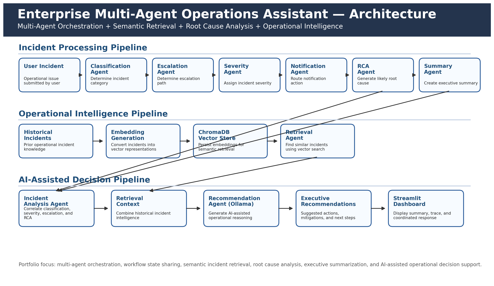

\# Enterprise Multi-Agent Operations Assistant


\## Overview


Enterprise Multi-Agent Operations Assistant is an AI-powered operational intelligence platform that demonstrates how multiple specialized AI agents collaborate using a shared workflow state to analyze incidents, determine severity, perform root cause analysis, retrieve historical incidents, and generate operational recommendations.


The project showcases multi-agent orchestration, agent-to-agent communication, semantic retrieval, executive summarization, and AI-assisted operational decision support.


\---


\## Key Features


\* Multi-Agent Orchestration

\* Shared Workflow State

\* Agent-to-Agent Communication

\* Incident Classification

\* Escalation Management

\* Severity Assessment

\* Notification Routing

\* Root Cause Analysis (RCA)

\* Executive Summary Generation

\* Historical Incident Retrieval

\* AI-Assisted Recommendations

\* Workflow Traceability

\* Streamlit Dashboard


\---


\## Architecture



```text

User Incident

&#x20;   ↓

Streamlit UI

&#x20;   ↓

Orchestrator Agent

&#x20;   ↓

Classification Agent

&#x20;   ↓

Escalation Agent

&#x20;   ↓

Severity Agent

&#x20;   ↓

Notification Agent

&#x20;   ↓

RCA Agent

&#x20;   ↓

Summary Agent

&#x20;   ↓

Incident Analysis Agent

&#x20;   ↓

Retrieval Agent (ChromaDB)

&#x20;   ↓

Recommendation Agent (Ollama)

&#x20;   ↓

Coordinated Multi-Agent Response

```


\---


\## Implemented Agents


\### Orchestrator Agent


Coordinates workflow execution and shared state management.


\### Classification Agent


Determines incident category.


\### Escalation Agent


Determines escalation path.


\### Severity Agent


Assigns incident severity.


\### Notification Agent


Determines notification actions.


\### RCA Agent


Generates likely root cause analysis.


\### Summary Agent


Creates executive operational summaries.


\### Incident Analysis Agent


Produces consolidated incident assessment.


\### Retrieval Agent


Retrieves similar historical incidents using semantic search.


\### Recommendation Agent


Generates AI-assisted recommendations.


\---


\## Technology Stack


\* Python

\* Streamlit

\* Ollama

\* Llama Models

\* ChromaDB

\* Vector Embeddings


\---


\## Sample Capabilities


\* Performance incident analysis

\* Availability incident analysis

\* Security incident analysis

\* Operational recommendations

\* Historical incident matching

\* Executive operational summaries

\* Workflow execution trace visualization


\---


\## Screenshots


Add screenshots of:


1\. Workflow Architecture

2\. Executive Summary Panel

3\. Workflow Execution Trace

4\. Multi-Agent Response Dashboard


\---


\## Project Status


\*\*Status:\*\* Advanced AI MVP Complete ✅


\*\*Completion:\*\* \~97%


\---


\## Outcome


Enterprise-style multi-agent operational intelligence platform demonstrating orchestration, retrieval, reasoning, root cause analysis, executive summarization, workflow traceability, and AI-assisted operational decision support.


